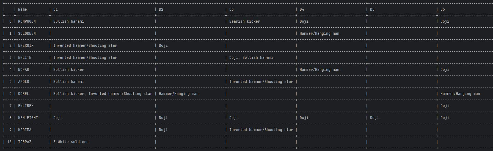
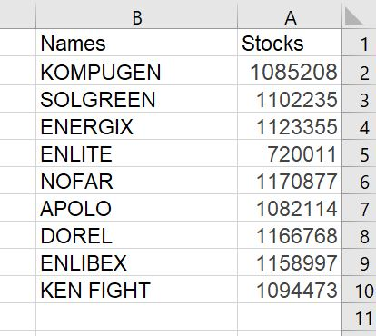

# Stocks Project
<p align="center">
  
</p>

## Description
This project extracts israeli's stocks information from tase.co.il 
website (the israeli's stock market's website) and writes them to an exel file.
Then the program reads this data from the exel file and analyzes it with algorithms
that are based on candlestick patterns.
The program displays this analysis with pandas library.

## Usage
1. Open Stocks.xlsx file and write the wanted stock's simbols to "Stocks Names" 
sheet. For each stock, write the stock's name in the "Names" column and the stock's
symbol as it is in the tase website in the "Stocks" column.

<p align="center">
  
</p>

2. Save the exel file and run "TLV_stocks.py"

3. The program will open firefox window with the tase website for each stock 
in order to save the data. Before the program opens the firefox for each stock, it will print
the name of the current stock. The final output of the program contains the names of the 
candlestick patterns that occured in the last 7 days for each stock.

<p align="center">
  
</p>

## Requirements
1. 
```bash
pip install -r requirments.txt
```
2. Need to download firefox browser.
